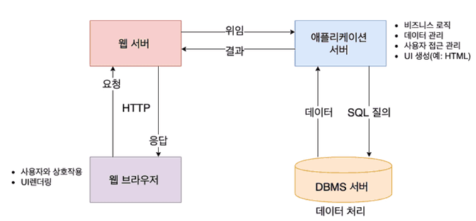

# 생각해 볼까요?

> 다음은 알아두면 재밌을, 어쩌면 몰라도 크게 상관없을 내용들이기도 합니다.
> 
> 관심이 있는 주제(최소 1개)에 대해서 더 알아보고 스터디원과 생각을 교류해 봅시다!

1. **DI**란 무엇인가요?
   - Compile-time Dependency와 Run-time Dependency의 차이를 아시나요?
   - DI의 단점은 무엇일까요?
   - IoC Container 없이 DI를 하려면 어떤 불편함이 있을까요?
   - SOILD 원칙 각각의 단점에 대해 생각해보신적이 있나요? 어떤 단점이 있을까요?
2. **TEST**란 무엇이고 왜 하는 걸까요?
   - Test Coverage에 대해 아시나요? 몇 %의 Coverage가 현실적으로 목표로 할 만 한가요?
   - TDD와 BDD의 차이에 대해 아시나요?
   - aaa와 gwt에 대해 아시나요?
   - Functionality Test에는 어떤 종류가 있을까요? E2E, integration, unit Test에 대해 들어보셨나요?
   - Performance Test에는 어떤 종류가 있을까요? Load, Stress, Endurance Test에 대해 들어보셨나요?
   - 호오옥시... Chaos Engineering에 대해 아시나요?

# 아래에 정리해 주세요!

> 정리 양식은 자유입니다! 몇 가지 주제에 대해서 알아오셨나요?

## 테스트 커버리지
### 테스트 커버리지란 시스템 또는 소프트웨어의 테스트를 논할 때 얼마나 테스트가 충분한가를 나타낸 것이다. 
### 즉, 수행한 테스트가 테스트의 대상을 얼마나 커버했는지를 나타낸다.

테스트를 기능에 대한 테스트부터 점점 작은 단위로 내려오다보면 단위 테스트의 경우 클래스, 컴포넌트 단위의 테스트를 하기 때문에  
테스트에 대한 커버 범위를 각각의 클래스 또는 소스 코드의 각 라인을 척도로 삼을 수 있게 된다.  
이렇게 코드가 얼마나 테스트 됐는지 나타내는 커버리지, 코드 커버리지(구조적 커버리지)라고 한다.  
소스 코드를 기반으로 수행하는 **화이트박스 테스트**를 통해 측정한다.  
---
💡 화이트 박스 테스트  
소프트웨어 내부 소스 코드의 **논리적인 모든 경로를 테스트**하여 모듈 내부의 작동을 확인하는 것이다. 모듈을 한번 이상 실행하므로써 수행된다.  

+) 블랙 박스 테스트  
사용자의 입장에서 구현된 기능이 완전하게 동작되는지를 확인하는 테스트이다. 소프트웨어 내부 코드 및 세부 동작을 알 필요없으며  
**입력 값에 따라 올바른 출력**값이 나오는 지 확인하는 테스트 이다.
---
테스트의 충분함을 측정한다.
테스트 대상의 전체 범위에서 테스트를 수행한 범위로 측정된다.
그렇다고 100%가 달성되면 완벽한 소프트웨어는 아니다.
---
## 코드 커버리지 측정 종류
코드의 구조를 살펴보면 크게 구문(Statement), 조건(Condition), 결정(Decision)의 구조로 이루어져 있다.  
코드 커버리지는 이러한 코드의 구조를 얼마나 커버했느냐에 따라 측정 기준을 나눈다.

- **구문 커버리지(Statement Coverage)**
- **결정 커버리지(Decision Coverage)**
- **조건 커버리지(Condition Coverage)**
- 조건/결정 커버리지(Condition/Decision Coverage)
- 변형 조건/결정 커버리지(Modified Condition/Decision Coverage)
- 다중 조건 커버리지(Multiple Condition Coverage)
- 경로 커버리지(All Path Coverage)



## 구문 커버리지(Statement Coverage)

라인(Line) 커버리지라고 부르기도 한다. **코드 한 줄이 한번 이상 실행**된다면 충족된다.

```
void test(int n) {
  // 함수 A 실행 - 1번
  if (n > 0) { //- 2번
    // 함수 B 실행 - 3번
  }
  // 함수 C 실행 - 4번
}
```

위에의 코드를 n 이 음수로 들어오는 테스트 하나만 했다고 하자. 그러면 **1~4번 구문중 3번 구문이 실행이 안돼**서 구문 커버리지는 3 / 4 \* 100% = 75% 인 테스트가 된다.

## 조건 커버리지(Condition Coverage)

여기서의 조건은 모든 조건식을 얘기한다. **내부 조건이 true/false의 경우를 충족하는 지**를 본다.

```
void test(int a, int b) {
  // 함수 A 실행 - 1번
  if (a > 0 && b < 0) { //- 2번
    // 함수 B 실행 - 3번
  }
  // 함수 C 실행 - 4번
}
```

여기서 내부 조건이란 조건 식 내부의 각각의 조건이다. 즉, a > 0 과 b < 0를 얘기하며 각각이 true/false의 경우가 있으면 조건 커버리지를 만족한다.  
위에 코드를 테스트하기 위해 a = 1, b = 1 과 a = -1, b = -1를 넣어보는 테스트를 만들었다고 해보자. 내부 조건식 a > 0와 b < 0 는  
모두 양수일 때와 음수일 때 테스트 케이스가 존재 **(a>0의 참/거짓 과 b<0의 참/거짓을 테스트해봄, 그러나 (a > 0 && b < 0)는 False,False임)** 하므로 조건 커버리지를 만족한다.

하지만 a > 0 && b < 0는 두 경우 모두 false 이므로 함수 B 실행의 구문이 들어간 경우는 테스트가 안되는 결과가 발생한다.

이처럼 테스트를 작성했을 때 **조건 커버리지를 만족하더라도 구문 커버리지와 이후에 나올 결정 커버리지를 만족하지 못하는 경우**가 존재한다.

## 결정 커버리지(Decision Coverage)

브랜치(Branch) 커버리지라고 부르기도 한다. **모든 조건식이 true/false를 가지게 되면** 충족된다.

```
void test(int a, int b) {
  // 함수 A 실행 - 1번
  if (a > 0 && b < 0) { //- 2번
    // 함수 B 실행 - 3번
  }
  // 함수 C 실행 - 4번
}
```

조건 커버리지에서의 예시를 다시 가져와보자. a = 1, b = 1 과 a = -1, b = -1를 넣어보는 테스트를 했을 때 조건 커버리지가 만족되더라도 함수 B가 실행되지 않았던 결과가 있었다.  
결정 커버리지를 만족한다면 이런 문제는 없을 것이다. 그 이유는 결정 커버리지에서 결정은 내부 조건이 아닌 조건식을 얘기한다. 즉, 위에 코드에서는 a > 0 && b < 0를 얘기한다.

따라서 결정 커버리지를 만족하는 테스트를 만든다고 한다면 a = 1, b = 1 과 a = -1, b = -1와 같이 조건식이 false만 나오는 식이 아닌 a = 1, b = -1 를  
넣는 테스트를 만들어야한다. 이 테스트 케이스를 넣게되면 **조건 커버리지와 결정 커버리지, 구문 커버리지를 모두 만족**할 수 있게된다.